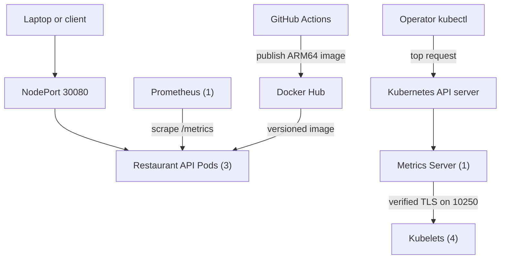

# SignalForge Architecture

**Last updated:** 2026-09-10

This document describes the current architecture of the active Foundry Initiative workstream. Detailed implementation history lives under `docs/milestones`, while operating procedures live under `docs/runbooks`.

## System purpose

SignalForge is a four-node Raspberry Pi Kubernetes lab for practicing cloud-native application delivery, release engineering, observability, troubleshooting, and eventually AI-assisted operations.

The first workload is the SignalForge Restaurant API, a small FastAPI service that makes infrastructure behavior visible through health endpoints, runtime metadata, application metrics, and intentionally simple operational workflows.

## Current topology

### Kubernetes platform

- Cluster: SignalForge Raspberry Pi Kubernetes cluster
- Control plane: `forge-head`
- Worker nodes: `forge-node-01`, `forge-node-02`, and `forge-node-03`
- Workload architecture: `linux/arm64`
- Operator access: laptop-based `kubectl`

### Restaurant API

- Source: `apps/restaurant-api`
- Namespace: `forge-restaurant`
- Deployment: `restaurant-api`
- Replicas: 3
- Current release: `0.7.0`
- Internal access: ClusterIP Service `restaurant-api`
- External lab access: NodePort Service on port `30080`
- Runtime configuration: ConfigMap `restaurant-api-config`
- Health signals: `/health` and `/ready`
- Application metrics: `/metrics`
- Deployment strategy: rolling update with readiness and liveness probes

### Metrics collection

- Manifests: `k8s/prometheus`
- Namespace: `forge-observability`
- Collector: one Prometheus replica using `prom/prometheus:v3.13.2`
- Discovery: Kubernetes Pod discovery limited to `forge-restaurant`
- Authorization: namespace-scoped Role granting only `get`, `list`, and `watch` on Pods
- Scrape model: each Restaurant API Pod is scraped independently every 30 seconds
- Access: ClusterIP Service and temporary `kubectl port-forward`
- Storage: retained 30 GiB local PV on the head NVMe, 30-day retention, and a 24 GB cap

Prometheus is deliberately lightweight at this stage. Grafana, Alertmanager, node-exporter, kube-state-metrics, and the Prometheus Operator are not installed.

### Approved persistent-storage target

Milestone 025 selected a static Kubernetes `local` PersistentVolume backed by a dedicated ext4 partition on the `forge-head` NVMe. The target design uses a non-default `WaitForFirstConsumer` StorageClass, a 30 GiB `ReadWriteOnce` claim, `Retain` reclaim policy, exact PV node affinity for `forge-head`, and Prometheus retention of 30 days or 24 GB.

The host-storage portion is prepared. Physical inventory identified the installed device as a 512 GB Samsung SSD 950 PRO, and its first 32 GiB partition is an ext4 filesystem mounted by UUID at `/mnt/signalforge-prometheus`. The `data` directory exists only on that mounted filesystem and is owned by Prometheus's verified `65534:65534` runtime identity.

The cutover is live. Prometheus uses the bound local claim on `forge-head`. Pod-replacement persistence and six-block off-node backup/restore analysis passed; port-forward verification and rollback testing remain open.

The design provides persistence across Pod replacement, not high availability. If `forge-head` is unavailable, Prometheus remains unavailable because the local volume cannot move to another node. Weekly cold backups will be copied off the head node so an NVMe failure does not make the node-local copy the only recovery source.

### Kubernetes resource metrics

- Manifests: `k8s/metrics-server`
- Namespace: `kube-system`
- Collector: one Metrics Server replica using `registry.k8s.io/metrics-server/metrics-server:v0.9.0`
- API: aggregated `metrics.k8s.io/v1beta1`
- Collection: current CPU and memory samples every 15 seconds
- Kubelet addressing: InternalIP first
- Kubelet trust: Kubernetes service-account CA
- Operator access: `kubectl top nodes` and `kubectl top pods`
- Observed footprint: 4m CPU and 21 MiB memory

Every kubelet uses a Kubernetes-CA-signed serving certificate containing its hostname and InternalIP as SANs. Metrics Server explicitly supplies `--kubelet-certificate-authority` and does not use `--kubelet-insecure-tls`.

Metrics Server and Prometheus have different responsibilities. Metrics Server retains only the latest resource samples needed by Kubernetes operations and autoscaling. Prometheus retains application time series for querying behavior over time.

## Application metric design

The Restaurant API publishes:

- application metadata and feature-state gauges
- a request counter labeled by method, matched route, status, and traffic type
- a request-duration histogram that can be aggregated across all three replicas

Kubernetes probes and Prometheus scrapes are classified as `traffic="synthetic"`. Other routes use `traffic="application"`. Unmatched URLs are normalized to `path="unmatched"` so arbitrary paths cannot create unbounded time-series cardinality.

Baseline queries are maintained in `docs/observability/prometheus-queries.md`.

## Delivery and validation flow

1. Application and infrastructure changes are developed in Git.
2. Restaurant API tests run through GitHub Actions.
3. Kubernetes manifests are checked by the repository validator and `promtool` where appropriate.
4. GitHub Actions builds and publishes the ARM64 container image to Docker Hub.
5. Version tags produce versioned release images.
6. PowerShell helpers apply the manifests and wait for Kubernetes rollouts.
7. Smoke tests, Prometheus target checks, and Metrics API checks validate the live deployment.

## Repository organization

- `apps/restaurant-api` contains the FastAPI source, container definition, dependencies, and tests.
- `k8s/fastapi-restaurant` contains the Restaurant API Kubernetes resources.
- `k8s/prometheus` contains the lightweight metrics-collection resources.
- `k8s/metrics-server` contains the Kubernetes resource-metrics API resources.
- `scripts` contains developer, deployment, smoke-test, and validation helpers.
- `.github/workflows` contains application CI, manifest validation, and ARM64 image publishing.
- `docs/milestones` preserves chronological implementation evidence.
- `docs/observability` contains reusable metrics queries and guidance.
- `docs/runbooks` contains operator procedures and recovery steps.

## Architectural principles

- Prefer small, demonstrable increments over broad platform installations.
- Keep configuration outside application source code.
- Pin release and infrastructure image versions.
- Apply least-privilege Kubernetes access.
- Prefer trusted serving certificates over disabling TLS validation.
- Protect metric label cardinality.
- Automate repeatable validation and preserve manual troubleshooting skills.
- Keep externally reachable services intentional; Prometheus remains ClusterIP-only.
- Record temporary limitations instead of hiding them.

## Current constraints

- Prometheus storage is node-local; head-node or NVMe failure requires recovery. Weekly backups remain manual, and full service-restoration timing has not been measured.
- NodePort is appropriate for the private lab but is not the long-term ingress design.
- Metrics Server provides current CPU and memory samples but no historical resource-metrics store.
- The upstream APIService uses `insecureSkipTLSVerify` for the API server-to-Metrics Server connection because the serving certificate is generated dynamically. This is separate from the secured Metrics Server-to-kubelet path.
- Kubelet serving-certificate rotation requests require deliberate operator review and approval.

## Expected evolution

Potential next architecture steps include:

1. Finish port-forward verification and rollback testing for the deployed local-PV design.
2. Add Grafana and alerting after the collection layer is understood.
3. Introduce Ingress for cleaner external access.
4. Evaluate Loki and OpenTelemetry for logs and traces.
5. Evolve the rules-based `/analyze` endpoint into the ForgeOps AI-assisted incident copilot.

## Decision records

Milestone documents currently serve as the chronological record of context, decisions, implementation, validation, and lessons. Larger cross-cutting decisions can later be promoted into dedicated records under `docs/decisions` when that additional structure provides value.
