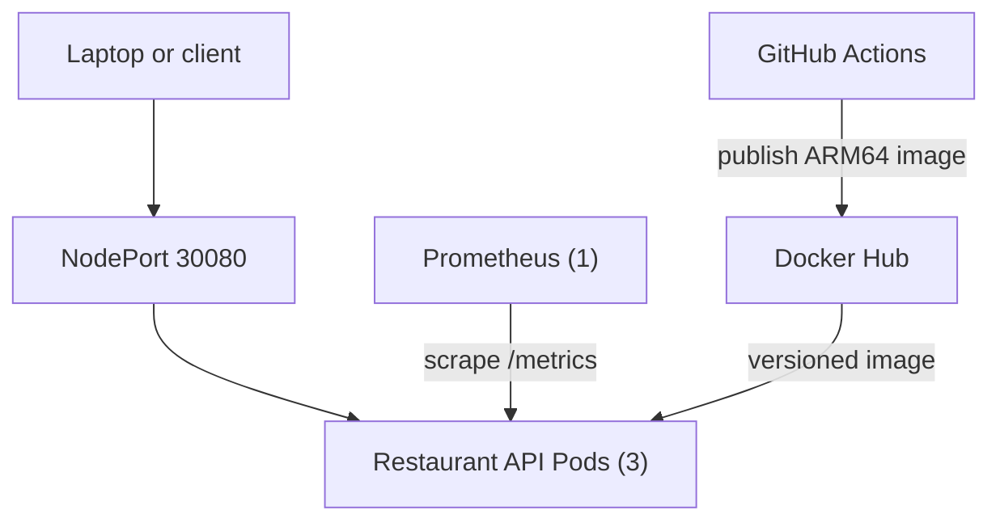

# SignalForge Architecture

**Last updated:** 2026-09-08

This document describes the current architecture of the active Foundry Initiative workstream. Detailed implementation history lives under `docs/milestones`, while operating procedures live under `docs/runbooks`.

## System purpose

SignalForge is a four-node Raspberry Pi Kubernetes lab for practicing cloud-native application delivery, release engineering, observability, troubleshooting, and eventually AI-assisted operations.

The first workload is the SignalForge Restaurant API, a small FastAPI service that makes infrastructure behavior visible through health endpoints, runtime metadata, application metrics, and intentionally simple operational workflows.

## Current topology

### Kubernetes platform

- Cluster: SignalForge Raspberry Pi Kubernetes cluster
- Control plane: `forge-head`
- Worker nodes: `forge-node-01`, `forge-node-02`, and `forge-node-03`
- Workload architecture: `linux/arm64`
- Operator access: laptop-based `kubectl`

### Restaurant API

- Source: `apps/restaurant-api`
- Namespace: `forge-restaurant`
- Deployment: `restaurant-api`
- Replicas: 3
- Current release: `0.7.0`
- Internal access: ClusterIP Service `restaurant-api`
- External lab access: NodePort Service on port `30080`
- Runtime configuration: ConfigMap `restaurant-api-config`
- Health signals: `/health` and `/ready`
- Application metrics: `/metrics`
- Deployment strategy: rolling update with readiness and liveness probes

### Metrics collection

- Manifests: `k8s/prometheus`
- Namespace: `forge-observability`
- Collector: one Prometheus replica using `prom/prometheus:v3.13.2`
- Discovery: Kubernetes Pod discovery limited to `forge-restaurant`
- Authorization: namespace-scoped Role granting only `get`, `list`, and `watch` on Pods
- Scrape model: each Restaurant API Pod is scraped independently every 30 seconds
- Access: ClusterIP Service and temporary `kubectl port-forward`
- Storage: 1 GiB `emptyDir`, 48-hour retention, and a 750 MB retention cap

Prometheus is deliberately lightweight at this stage. Grafana, Alertmanager, node-exporter, kube-state-metrics, and the Prometheus Operator are not installed.

## Application metric design

The Restaurant API publishes:

- application metadata and feature-state gauges
- a request counter labeled by method, matched route, status, and traffic type
- a request-duration histogram that can be aggregated across all three replicas

Kubernetes probes and Prometheus scrapes are classified as `traffic="synthetic"`. Other routes use `traffic="application"`. Unmatched URLs are normalized to `path="unmatched"` so arbitrary paths cannot create unbounded time-series cardinality.

Baseline queries are maintained in `docs/observability/prometheus-queries.md`.

## Delivery and validation flow

1. Application and infrastructure changes are developed in Git.
2. Restaurant API tests run through GitHub Actions.
3. Kubernetes manifests are checked by the repository validator and `promtool` where appropriate.
4. GitHub Actions builds and publishes the ARM64 container image to Docker Hub.
5. Version tags produce versioned release images.
6. PowerShell helpers apply the manifests and wait for Kubernetes rollouts.
7. Smoke tests and Prometheus target checks validate the live deployment.

## Repository organization

- `apps/restaurant-api` contains the FastAPI source, container definition, dependencies, and tests.
- `k8s/fastapi-restaurant` contains the Restaurant API Kubernetes resources.
- `k8s/prometheus` contains the lightweight metrics-collection resources.
- `scripts` contains developer, deployment, smoke-test, and validation helpers.
- `.github/workflows` contains application CI, manifest validation, and ARM64 image publishing.
- `docs/milestones` preserves chronological implementation evidence.
- `docs/observability` contains reusable metrics queries and guidance.
- `docs/runbooks` contains operator procedures and recovery steps.

## Architectural principles

- Prefer small, demonstrable increments over broad platform installations.
- Keep configuration outside application source code.
- Pin release and infrastructure image versions.
- Apply least-privilege Kubernetes access.
- Protect metric label cardinality.
- Automate repeatable validation and preserve manual troubleshooting skills.
- Keep externally reachable services intentional; Prometheus remains ClusterIP-only.
- Record temporary limitations instead of hiding them.

## Current constraints

- Prometheus storage is ephemeral and is lost when its Pod is replaced or rescheduled.
- The Kubernetes Metrics API is not installed, so `kubectl top` is unavailable.
- NodePort is appropriate for the private lab but is not the long-term ingress design.
- Observability currently focuses on application metrics rather than full cluster telemetry.

## Expected evolution

Potential next architecture steps include:

1. Evaluate Kubernetes Metrics Server for lightweight CPU and memory visibility.
2. Move Prometheus data to persistent NVMe-backed storage.
3. Add Grafana and alerting after the collection layer is understood.
4. Introduce Ingress for cleaner external access.
5. Evaluate Loki and OpenTelemetry for logs and traces.
6. Evolve the rules-based `/analyze` endpoint into the ForgeOps AI-assisted incident copilot.

## Decision records

Milestone documents currently serve as the chronological record of context, decisions, implementation, validation, and lessons. Larger cross-cutting decisions can later be promoted into dedicated records under `docs/decisions` when that additional structure provides value.
