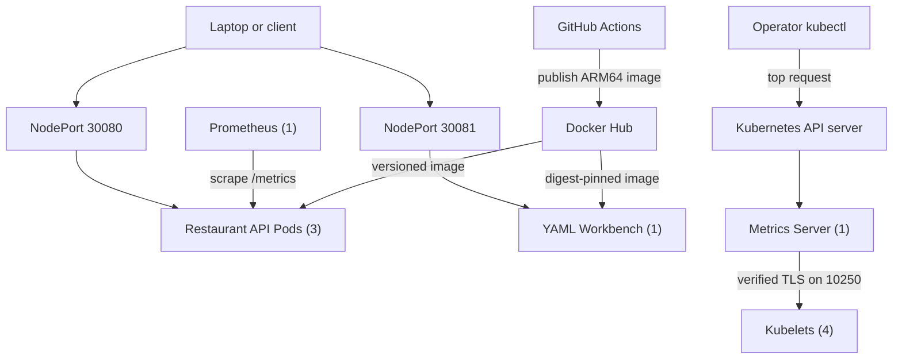
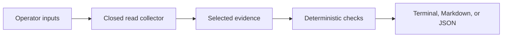

# SignalForge Architecture

**Last updated:** 2026-09-16

This document describes the current architecture of the active Foundry Initiative workstream. Detailed implementation history lives under `docs/milestones`, while operating procedures live under `docs/runbooks`.

## System purpose

SignalForge is a four-node Raspberry Pi Kubernetes lab for practicing cloud-native application delivery, release engineering, observability, troubleshooting, and eventually AI-assisted operations.

The primary workload is the SignalForge Restaurant API, a small FastAPI service that makes infrastructure behavior visible through health endpoints, runtime metadata, application metrics, and intentionally simple operational workflows. Forge YAML Workbench is a separate stateless browser application for inspecting Kubernetes and general YAML without granting it cluster access.

## Current topology

### Kubernetes platform

- Cluster: SignalForge Raspberry Pi Kubernetes cluster
- Control plane: `forge-head`
- Worker nodes: `forge-node-01`, `forge-node-02`, and `forge-node-03`
- Workload architecture: `linux/arm64`
- Operator access: laptop-based `kubectl`

### Restaurant API

- Source: `apps/restaurant-api`
- Namespace: `forge-restaurant`
- Deployment: `restaurant-api`
- Replicas: 3
- Current release: `0.7.0`
- Internal access: ClusterIP Service `restaurant-api`
- External lab access: NodePort Service on port `30080`
- Runtime configuration: ConfigMap `restaurant-api-config`
- Health signals: `/health` and `/ready`
- Application metrics: `/metrics`
- Deployment strategy: rolling update with readiness and liveness probes

### Forge YAML Workbench

- Source: `apps/forge-yaml-workbench`
- Manifests: `k8s/forge-yaml-workbench`
- Namespace: `forge-tools`
- Deployment: one stateless replica using accepted immutable release `0.10.0` with browser-local Tree search and safe one-file YAML drop
- Access: private-lab NodePort `30081`
- Runtime: unprivileged NGINX on container port `8080`
- Processing: shared YAML parsing, formatting preview, line-diff generation, diagnostics, guarded local-file opening and drop handling, tree navigation and search, Markdown report generation, and Validation display filtering run entirely in the browser; local files are read through the browser File API without upload, Tree search and display filters do not change analysis or report contents, and Kubernetes-specific operational findings, the bundled `v1.36.4` schema validator, and the pinned OWASP Top 10:2025 review profile run only in Kubernetes mode
- Schema boundary: the Milestone 036 implementation supports 12 explicit core, apps, and batch GVKs; unsupported built-ins and unavailable CRD schemas receive non-validity result states. The published `0.4.1` correction uses build-time standalone validators so the strict CSP remains intact.
- Security-review boundary: Milestone 037 labels OWASP categories as direct, partial, or cluster-context-required. Manifest-local signals are not compliance results and cannot establish effective RBAC, policy enforcement, network reachability, component vulnerability, authentication, audit, logging, or monitoring state.
- Identity: no RBAC, Kubernetes API access, or mounted ServiceAccount token
- Security: restricted Pod Security labels, non-root execution, RuntimeDefault seccomp, read-only root filesystem, dropped capabilities, and bounded writable `/tmp`
- Delivery: guarded version tags publish AMD64 and ARM64 images; the Deployment pins both version and OCI index digest

### Metrics collection

- Manifests: `k8s/prometheus`
- Namespace: `forge-observability`
- Collector: one Prometheus replica using `prom/prometheus:v3.13.2`
- Discovery: Kubernetes Pod discovery limited to `forge-restaurant`
- Authorization: namespace-scoped Role granting only `get`, `list`, and `watch` on Pods
- Scrape model: each Restaurant API Pod is scraped independently every 30 seconds
- Access: ClusterIP Service and temporary `kubectl port-forward`
- Storage: retained 30 GiB local PV on the head NVMe, 30-day retention, and a 24 GB cap

Prometheus remains deliberately lightweight. Grafana is deployed as a separate visualization layer; Alertmanager, node-exporter, kube-state-metrics, and the Prometheus Operator are not installed.

### Approved persistent-storage target

Milestone 025 selected a static Kubernetes `local` PersistentVolume backed by a dedicated ext4 partition on the `forge-head` NVMe. The target design uses a non-default `WaitForFirstConsumer` StorageClass, a 30 GiB `ReadWriteOnce` claim, `Retain` reclaim policy, exact PV node affinity for `forge-head`, and Prometheus retention of 30 days or 24 GB.

The host-storage portion is prepared. Physical inventory identified the installed device as a 512 GB Samsung SSD 950 PRO, and its first 32 GiB partition is an ext4 filesystem mounted by UUID at `/mnt/signalforge-prometheus`. The `data` directory exists only on that mounted filesystem and is owned by Prometheus's verified `65534:65534` runtime identity.

The cutover is live. Prometheus uses the bound local claim on `forge-head`. Pod-replacement persistence and six-block off-node backup/restore analysis passed; port-forward verification and storage rollback/return also passed.

The design provides persistence across Pod replacement, not high availability. If `forge-head` is unavailable, Prometheus remains unavailable because the local volume cannot move to another node. Weekly cold backups will be copied off the head node so an NVMe failure does not make the node-local copy the only recovery source.

### Kubernetes resource metrics

- Manifests: `k8s/metrics-server`
- Namespace: `kube-system`
- Collector: one Metrics Server replica using `registry.k8s.io/metrics-server/metrics-server:v0.9.0`
- API: aggregated `metrics.k8s.io/v1beta1`
- Collection: current CPU and memory samples every 15 seconds
- Kubelet addressing: InternalIP first
- Kubelet trust: Kubernetes service-account CA
- Operator access: `kubectl top nodes` and `kubectl top pods`
- Observed footprint: 4m CPU and 21 MiB memory

Every kubelet uses a Kubernetes-CA-signed serving certificate containing its hostname and InternalIP as SANs. Metrics Server explicitly supplies `--kubelet-certificate-authority` and does not use `--kubelet-insecure-tls`.

Metrics Server and Prometheus have different responsibilities. Metrics Server retains only the latest resource samples needed by Kubernetes operations and autoscaling. Prometheus retains application time series for querying behavior over time.

## Application metric design

The Restaurant API publishes:

- application metadata and feature-state gauges
- a request counter labeled by method, matched route, status, and traffic type
- a request-duration histogram that can be aggregated across all three replicas

Kubernetes probes and Prometheus scrapes are classified as `traffic="synthetic"`. Other routes use `traffic="application"`. Unmatched URLs are normalized to `path="unmatched"` so arbitrary paths cannot create unbounded time-series cardinality.

Baseline queries are maintained in `docs/observability/prometheus-queries.md`.

## Delivery and validation flow

Milestone 029's limited-alerting design is accepted and merged. Milestone 030's canonical rules passed all 19 pinned-promtool scenarios and are now loaded by the existing Prometheus evaluator through the existing read-only `/etc/prometheus` ConfigMap mount. Activation changed only the ConfigMap and restarted only Prometheus after an exact-baseline check, dry-run, reviewed diff, recovery capture and explicit approval. Immediate and independent checks confirmed an exact live/repository match, three healthy targets, and two rules with healthy inactive state. Grafana unified alerting remains disabled, and no Alertmanager, receiver or notification path is configured; evaluator failure remains an uncovered condition.

1. Application and infrastructure changes are developed in Git.
2. Restaurant API tests run through GitHub Actions.
3. Kubernetes manifests are checked by the repository validator and `promtool` where appropriate.
4. GitHub Actions builds the Restaurant API ARM64 image and Workbench AMD64/ARM64 image.
5. Guarded version tags publish versioned release images to Docker Hub.
6. PowerShell helpers apply the manifests and wait for Kubernetes rollouts.
7. Smoke tests, Prometheus target checks, and Metrics API checks validate the live deployment.

## Repository organization

- `apps/restaurant-api` contains the FastAPI source, container definition, dependencies, and tests.
- `apps/forge-yaml-workbench` contains the browser application, analyzer, tests, and unprivileged web container.
- `k8s/fastapi-restaurant` contains the Restaurant API Kubernetes resources.
- `k8s/prometheus` contains the lightweight metrics-collection resources.
- `k8s/metrics-server` contains the Kubernetes resource-metrics API resources.
- `k8s/forge-yaml-workbench` contains the restricted namespace, hardened Deployment, NodePort Service, and operating notes.
- `scripts` contains developer, deployment, smoke-test, and validation helpers.
- `.github/workflows` contains application CI, manifest validation, and ARM64 image publishing.
- `docs/milestones` preserves chronological implementation evidence.
- `docs/observability` contains reusable metrics queries and guidance.
- `docs/runbooks` contains operator procedures and recovery steps.
- `docs/wiki` contains the reviewed source for the derivative GitHub Wiki Home and sidebar.

## ForgeOps snapshot boundary

Milestone 045 implements the Milestone 044 contract as a separate local Python command with no in-cluster workload or identity. It requires an explicit kubeconfig and exact context, invokes only a closed set of read operations, reduces raw responses to accepted fields, applies deterministic checks, and renders equivalent terminal and Markdown views. Milestone 046 adds a deterministic JSON view of that same evaluated model without adding collection authority.

The first contract is deliberately SignalForge-specific. It covers the four expected nodes; the Restaurant API, Prometheus, Grafana, Forge YAML Workbench, and Metrics Server Deployments and Pods; allowlisted EndpointSlices; Metrics APIService availability; and optional GET requests to explicitly configured Restaurant API and Workbench endpoints. Missing or incomplete evidence remains `UNKNOWN` and prevents a healthy overall result.

The boundary excludes broad discovery, Events, logs, Secrets, ConfigMaps, RBAC contents, arbitrary API paths, port-forwarding, temporary Pods, AI reasoning, remediation, and every cluster mutation. In particular, it does not reuse the existing mutating smoke-test path. Collection, normalization, deterministic evaluation, and rendering are separate and covered by synthetic offline fixtures. Milestone 045 live acceptance passed against the exact published implementation; Milestone 046 live JSON acceptance remains a separate future gate.

`src/forgeops/constants.py` owns the fixed SignalForge identities and limits. `runners.py` owns the deny-by-default process and network boundaries. `collect.py` owns collection and selected-field normalization, `evaluate.py` owns status semantics, and `render.py` owns presentation. The JSON renderer serializes only `EvaluatedSnapshot`; it cannot invoke subprocesses, contact a network, read a file, or recover discarded raw fields. A future reasoning layer may consume this evidence but must not expand collection or mutation authority implicitly.

## Documentation authority and publication

The main repository is the authoritative documentation system. `ROADMAP.md` owns direction and sequencing, `docs/project-status.md` owns current live state, `docs/architecture.md` owns system design and constraints, `docs/milestones` owns chronological evidence, and `docs/runbooks` owns operator procedures.

The GitHub Wiki is a separate Git repository and serves only as a curated front door. Its Home and sidebar are published as exact copies of the reviewed files under `docs/wiki`; they contain stable orientation and links rather than versions, live state, commands, recovery steps, or acceptance evidence. If the Wiki and repository ever disagree, the repository is authoritative.

Routine Wiki changes begin in the main repository, pass offline structure and link validation, receive normal review, and require separate approval before the live Wiki is mutated. Direct browser edits are reserved for an explicitly approved recovery or rollback.

## Architectural principles

- Prefer small, demonstrable increments over broad platform installations.
- Keep configuration outside application source code.
- Pin release and infrastructure image versions.
- Apply least-privilege Kubernetes access.
- Prefer trusted serving certificates over disabling TLS validation.
- Protect metric label cardinality.
- Automate repeatable validation and preserve manual troubleshooting skills.
- Keep externally reachable services intentional; Prometheus remains ClusterIP-only.
- Record temporary limitations instead of hiding them.

## Current constraints

- Prometheus storage is node-local; head-node or NVMe failure requires recovery. Weekly backups remain manual, and full service-restoration timing has not been measured.
- NodePort is appropriate for the private lab but is not the long-term ingress design.
- Metrics Server provides current CPU and memory samples but no historical resource-metrics store.
- The upstream APIService uses `insecureSkipTLSVerify` for the API server-to-Metrics Server connection because the serving certificate is generated dynamically. This is separate from the secured Metrics Server-to-kubelet path.
- Kubelet serving-certificate rotation requests require deliberate operator review and approval.
- Workbench schema checks are bounded to the bundled `v1.36.4` support set and are not Kubernetes API discovery, defaulting, conversion, admission, policy, or webhook validation; NodePort `30081` is private-lab HTTP exposure.

## Expected evolution

Potential next architecture steps include:

1. Observe naturally occurring limited-alert behavior before designing notification delivery.
2. Continue the demonstrated Prometheus and Grafana backup cadence.
3. Introduce Ingress and TLS for cleaner private-lab access when selected as a bounded milestone.
4. Evaluate Loki and OpenTelemetry only for defined logging or tracing questions.
5. Validate the deterministic ForgeOps JSON evidence artifact through its separately approved read-only live gate before adding comparison, replay, incident reasoning, or recommendations.

## Decision records

Milestone documents currently serve as the chronological record of context, decisions, implementation, validation, and lessons. Larger cross-cutting decisions can later be promoted into dedicated records under `docs/decisions` when that additional structure provides value.
