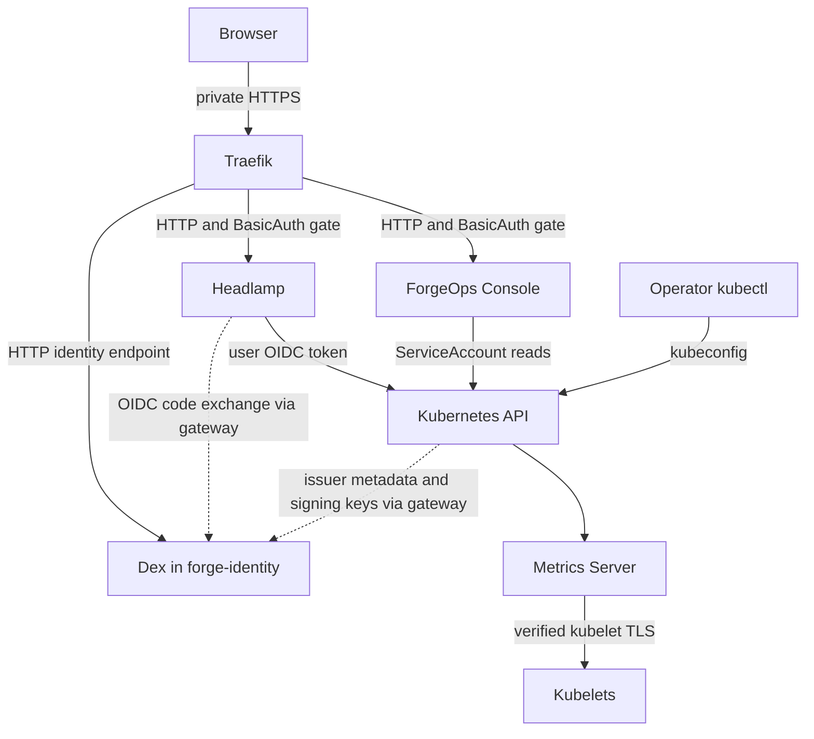
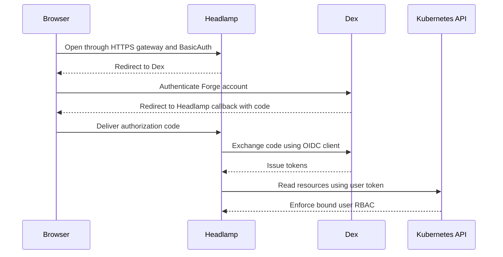
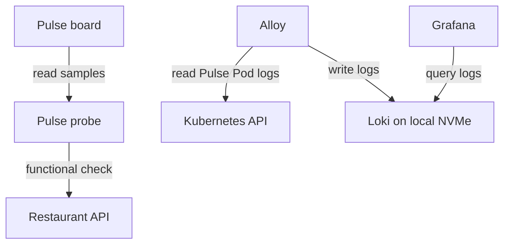
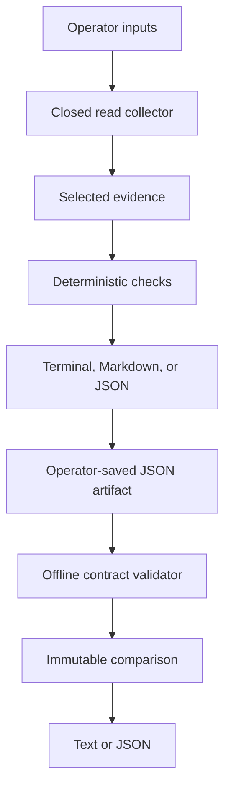

# SignalForge Architecture

**Last updated:** 2026-09-29

This document describes the current architecture of the active Foundry Initiative workstream. Detailed implementation history lives under `docs/milestones`, while operating procedures live under `docs/runbooks`.

## System purpose

SignalForge is a four-node Raspberry Pi Kubernetes lab for practicing
cloud-native application delivery, release engineering, observability,
troubleshooting, deterministic incident analysis, and carefully gated future
assistance.

The primary workload is the SignalForge Restaurant API, a small FastAPI service that makes infrastructure behavior visible through health endpoints, runtime metadata, application metrics, and intentionally simple operational workflows. Forge YAML Workbench is a separate stateless browser application for inspecting Kubernetes and general YAML without granting it cluster access.

## Current topology

The portal links to seven applications; their access methods are listed in the
[operations index](runbooks/README.md). HTTPS terminates at Traefik. The
application ingress backends currently use HTTP inside the cluster, so the
private certificate does not establish encryption of those internal hops.
The Restaurant and Workbench NodePorts also remain alternate HTTP paths.

The following diagram shows the Kubernetes inspection paths and Headlamp's
Dex identity provider. The dotted OIDC relationships use Dex's HTTPS issuer
through Traefik; they do not represent direct connections to the Dex Pod.

```mermaid
flowchart TD
    Browser["Browser"] -->|private HTTPS| Gateway["Traefik"]
    Gateway -->|HTTP and BasicAuth gate| Headlamp["Headlamp"]
    Gateway -->|HTTP and BasicAuth gate| Console["ForgeOps Console"]
    Gateway -->|HTTP identity endpoint| Dex["Dex in forge-identity"]
    Headlamp -.->|OIDC code exchange via gateway| Dex
    Headlamp -->|user OIDC token| APIServer["Kubernetes API"]
    APIServer -.->|issuer metadata and signing keys via gateway| Dex
    Console -->|ServiceAccount reads| APIServer
    Operator["Operator kubectl"] -->|kubeconfig| APIServer
    APIServer --> MetricsServer["Metrics Server"]
    MetricsServer -->|verified kubelet TLS| Kubelets["Kubelets"]
```

Dex serves `https://auth.forge.home.arpa/`. During Headlamp sign-in, the
browser is redirected there to authenticate. Headlamp exchanges the returned
authorization code for tokens and presents the user's ID token to Kubernetes.
The API server verifies it using Dex's public signing keys, then applies the
user's Kubernetes RBAC. Dex supplies identity; Kubernetes decides which
resources that identity can read. The separate Headlamp BasicAuth gate remains
at Traefik. ForgeOps Console's ServiceAccount path does not use Dex.
See the [login sequence](#headlamp-identity-and-authorization) for the detailed
flow and [Dex's Kubernetes guide](https://dexidp.io/docs/guides/kubernetes/)
for the token-verification model.

### Kubernetes platform

- Cluster: SignalForge Raspberry Pi Kubernetes cluster
- Control plane: `forge-head`
- Worker nodes: `forge-node-01`, `forge-node-02`, and `forge-node-03`
- Workload architecture: `linux/arm64`
- Operator access: laptop-based `kubectl`

### Restaurant API

- Source: `apps/restaurant-api`
- Namespace: `forge-restaurant`
- Deployment: `restaurant-api`
- Replicas: 3
- Current release: `0.7.0`
- Internal access: ClusterIP Service `restaurant-api`
- External lab access: NodePort Service on port `30080`
- Runtime configuration: ConfigMap `restaurant-api-config`
- Health signals: `/health` and `/ready`
- Application metrics: `/metrics`
- Deployment strategy: rolling update with readiness and liveness probes

### Forge YAML Workbench

- Source: `apps/forge-yaml-workbench`
- Manifests: `k8s/forge-yaml-workbench`
- Namespace: `forge-tools`
- Deployment: one stateless replica using accepted immutable release `0.10.0` with browser-local Tree search and safe one-file YAML drop
- Access: portal HTTPS route plus alternate private-lab NodePort `30081`
- Runtime: unprivileged NGINX on container port `8080`
- Processing: shared YAML parsing, formatting preview, line-diff generation, diagnostics, guarded local-file opening and drop handling, tree navigation and search, Markdown report generation, and Validation display filtering run entirely in the browser; local files are read through the browser File API without upload, Tree search and display filters do not change analysis or report contents, and Kubernetes-specific operational findings, the bundled `v1.36.4` schema validator, and the pinned OWASP Top 10:2025 review profile run only in Kubernetes mode
- Schema boundary: the Milestone 036 implementation supports 12 explicit core, apps, and batch GVKs; unsupported built-ins and unavailable CRD schemas receive non-validity result states. The published `0.4.1` correction uses build-time standalone validators so the strict CSP remains intact.
- Security-review boundary: Milestone 037 labels OWASP categories as direct, partial, or cluster-context-required. Manifest-local signals are not compliance results and cannot establish effective RBAC, policy enforcement, network reachability, component vulnerability, authentication, audit, logging, or monitoring state.
- Identity: no RBAC, Kubernetes API access, or mounted ServiceAccount token
- Security: restricted Pod Security labels, non-root execution, RuntimeDefault seccomp, read-only root filesystem, dropped capabilities, and bounded writable `/tmp`
- Delivery: guarded version tags publish AMD64 and ARM64 images; the Deployment pins both version and OCI index digest

### ForgeOps Console: workstation preview and cluster pilot

- Source: `apps/forgeops-console`; published as the Windows engineering preview
  [v0.1.0-rc.1](https://github.com/wmstipes/The-Foundry-Initiative/releases/tag/forgeops-console-v0.1.0-rc.1).
- Browser-to-core traffic stays on the configured loopback listener. The Go core
  alone loads one explicit kubeconfig and contacts the selected Kubernetes API.
- The browser receives bounded projections and metadata, not kubeconfig
  credentials. Logs/Events can contain application secrets and are not guaranteed
  redacted. Host/Origin/nonce checks and scope generations constrain requests.
- Example, resources and diagnostics are compiled first-party plugins; they are
  trusted code, not isolated third-party modules. Read-only routes do not reduce
  the Kubernetes permissions of the supplied identity.
- The separate in-cluster pilot runs in `forge-console` as one restricted ARM64
  replica behind a ClusterIP Service. Traefik terminates private HTTPS at
  `https://forgeops.forge.home.arpa/` and applies a dedicated BasicAuth gate.
  The Pod uses a dedicated read-only ServiceAccount, a fixed `forge` context and
  an ingress NetworkPolicy permitting Traefik. The cluster runtime accepts no
  workstation kubeconfig; it has one process-wide scope, so use one operator
  at a time. BasicAuth is not per-user Kubernetes RBAC.
- The `0.1.1` image is deployed by OCI index digest. Its rollout, Service
  endpoint, anonymous `401`, and authenticated browser session were observed
  on 2026-09-27. The initial `0.1.0` image exited due to a loopback-only
  listener check; do not redeploy it. See the [cluster runbook](../k8s/forgeops-console/README.md).
- Both modes remain independent of the ForgeOps CLI and Workbench. There is no
  Console-to-ForgeOps evidence export/intake connection.

See the [implemented compatibility/lifecycle boundary](design/forgeops-console-c6-compatibility-lifecycle.md)
and [C7 acceptance record](milestones/forgeops-console-c7-release-readiness.md).

### Private LAN gateway and service access

MetalLB advertises `192.168.243.250` on the LAN for the Traefik LoadBalancer.
The two-replica [Forge portal](../k8s/lan-portal/README.md) at
`https://forge.home.arpa/` links to the Workbench, Restaurant API, Grafana,
Prometheus, ForgeOps Console, Headlamp, and Service Pulse. A cert-manager issued wildcard
certificate chains to the offline Project Forge root CA; laptop clients trust
only the exported public root. Local hosts-file entries resolve the names;
NUC setup remains deferred. HTTP redirects to HTTPS. Grafana retains its
own login, while Prometheus, Console, Headlamp, and Service Pulse use separate
BasicAuth credentials. The Headlamp and Service Pulse board Services remain
ClusterIP; their protected HTTPS routes and ingress policies are active.
Service Pulse's probe remains an internal Service. Anonymous requests to the
new protected routes returned `401`, and their browser access was exercised.
The LAN,
Traefik/MetalLB gateway, single control plane and local PVs remain availability
constraints; two portal replicas alone do not make the entry point highly
available.

### Headlamp identity and authorization

Headlamp's normal interactive login uses a privately deployed Dex identity
provider in `forge-identity`. The browser follows the OIDC authorization flow
through the HTTPS gateway; Headlamp exchanges the callback for a token and
presents the user's OIDC identity to the Kubernetes API server. The API server
validates Dex-issued tokens using the trusted public Forge root CA and maps
the email claim to a prefixed Kubernetes username. A distinct user binding
grants built-in `view` plus `get/list/watch` on Nodes. Impersonation checks
confirmed Pod and Node listing, and denied Secrets and Deployment creation;
the operator confirmed interactive sign-in and cluster browsing on 2026-09-28.
The ingress BasicAuth gate remains in front of Headlamp during this pilot.
Neither that gate nor Headlamp's ServiceAccount grants the signed-in user
additional Kubernetes RBAC. Operator-created short-lived token access was
used before OIDC and has not been retested after the upgrade.

Dex runs as a single replica with Kubernetes-backed storage; the API server
is also a single control plane. Availability of the identity provider and
gateway therefore affects new logins. The identity provider configuration,
client secret, local Helm overlay, certificate material, and control-plane
rollback copies are managed outside this public repository. The checked-in
Headlamp base values alone do not reproduce the running OIDC installation.
See the [Headlamp operating notes](../k8s/headlamp/README.md) and
[identity operations](runbooks/headlamp-oidc.md).

```mermaid
sequenceDiagram
    participant B as Browser
    participant H as Headlamp
    participant D as Dex
    participant K as Kubernetes API
    B->>H: Open through HTTPS gateway and BasicAuth
    H-->>B: Redirect to Dex
    B->>D: Authenticate Forge account
    D-->>B: Redirect to Headlamp callback with code
    B->>H: Deliver authorization code
    H->>D: Exchange code using OIDC client
    D-->>H: Issue tokens
    H->>K: Read resources using user token
    K-->>H: Enforce bound user RBAC
```

The API server obtains issuer metadata and signing keys from Dex over trusted
HTTPS for token verification. Dex stores identity state in Kubernetes; new
logins consequently depend on the API, the gateway, name resolution, and CA
trust. Full cold-start recovery has not been rehearsed. On September 29,
kubeadm's saved configuration and an installed host-alias patch reproduced
the reviewed API-server manifest in dry-run mode. Upgrades must explicitly
supply `/etc/kubernetes/forge-kubeadm-patches`; patches are not auto-discovered.
Off-node snapshot/archive verification and offline etcd reconstruction passed;
see the [dated evidence and limits](milestones/identity-preservation-recovery-2026-09-29.md).

### Service Pulse and central logging

The board reads the probe's bounded in-memory samples. The probe checks the
Restaurant API's internal menu endpoint; neither component holds Kubernetes
credentials. Alloy independently reads Pulse Pod logs through namespace-scoped
Kubernetes RBAC and sends them to Loki. Grafana queries both Loki logs and
Prometheus metrics. Probe sample history resets with the probe; persisted logs
have their own retention and recovery lifecycle.

```mermaid
flowchart TD
    Board["Pulse board"] -->|read samples| Probe["Pulse probe"]
    Probe -->|functional check| Restaurant["Restaurant API"]
    Alloy["Alloy"] -->|read Pulse Pod logs| API["Kubernetes API"]
    Alloy -->|write logs| Loki["Loki on local NVMe"]
    Grafana["Grafana"] -->|query logs| Loki
```

An off-node Loki backup, production restart persistence, and an isolated
restore passed; naturally elapsed seven-day retention remains unverified.
See the [recovery record](milestones/loki-recovery-candidate.md). The single
head/NVMe dependency applies to Loki as well as Prometheus and Grafana.

### Metrics collection

- Manifests: `k8s/prometheus`
- Namespace: `forge-observability`
- Collector: one Prometheus replica using `prom/prometheus:v3.13.2`
- Discovery: Kubernetes Pod discovery limited to `forge-restaurant`
- Authorization: namespace-scoped Role granting only `get`, `list`, and `watch` on Pods
- Scrape model: each Restaurant API Pod is scraped independently every 30 seconds
- Lab scrape: three static Envoy targets at port 15090 in `forge-mesh-lab`, each on its own metrics Service
- Access: ClusterIP Service plus authenticated private HTTPS at `https://prometheus.forge.home.arpa/`; port-forward remains available for maintenance
- Storage: retained 30 GiB local PV on the head NVMe, 30-day retention, and a 24 GB cap

Prometheus remains deliberately lightweight. Grafana is deployed as a separate visualization layer; Alertmanager, node-exporter, kube-state-metrics, and the Prometheus Operator are not installed.
The two existing alert rules cover the three Restaurant API scrape targets;
the additional lab targets do not change that alerting contract. Removing a
lab metrics Service while leaving its static scrape target configured will
produce an unhealthy target. See the [lab runbook](../k8s/istio-lab/README.md)
for the meshed steady state and optional collector rollback.

### Istio learning lab

- Namespace: `forge-mesh-lab`; only this namespace has injection enabled
- Workloads: `lab-api-v1`, `lab-api-v2`, and `lab-client`, one replica each with an Envoy sidecar
- Routing: `Service/lab-api` selects both versions; `DestinationRule` defines their subsets; `VirtualService` normally sends 50% to each
- Traffic: the client requests `http://lab-api:8080/` every 15 seconds and logs failures; manual requests can exercise stable, canary, and deliberate `/break` fault routes
- Observability: Prometheus scrapes the three proxy metrics Services; Grafana provisions the six-panel **SignalForge Istio Learning Lab** dashboard

The minimal Istio control plane remains installed for learning. There is no
mesh gateway, NodePort, NetworkPolicy, or production namespace injection in
this lab. The ClusterIP API and cleartext proxy metrics endpoints are reachable
from cluster Pods, so the namespace is not a network security boundary.
Without Istio CNI, the current sidecar init configuration requires Pod
Security `privileged` enforcement in this lab namespace while meshed; audit
and warn remain restricted. This is an explicit ongoing constraint. The
known-good route is `route-canary.yaml`, and `route-stable.yaml` selects only
v1 when a simpler diagnosis is useful. The ForgeOps CLI and Console do not
collect mesh evidence or control Istio routing.

### Approved persistent-storage target

Milestone 025 selected a static Kubernetes `local` PersistentVolume backed by a dedicated ext4 partition on the `forge-head` NVMe. The target design uses a non-default `WaitForFirstConsumer` StorageClass, a 30 GiB `ReadWriteOnce` claim, `Retain` reclaim policy, exact PV node affinity for `forge-head`, and Prometheus retention of 30 days or 24 GB.

The host-storage portion is prepared. Physical inventory identified the installed device as a 512 GB Samsung SSD 950 PRO, and its first 32 GiB partition is an ext4 filesystem mounted by UUID at `/mnt/signalforge-prometheus`. The `data` directory exists only on that mounted filesystem and is owned by Prometheus's verified `65534:65534` runtime identity.

The cutover is live. Prometheus uses the bound local claim on `forge-head`. Pod-replacement persistence and six-block off-node backup/restore analysis passed; port-forward verification and storage rollback/return also passed.

The design provides persistence across Pod replacement, not high availability. If `forge-head` is unavailable, Prometheus remains unavailable because the local volume cannot move to another node. Weekly cold backups will be copied off the head node so an NVMe failure does not make the node-local copy the only recovery source.

### Kubernetes resource metrics

- Manifests: `k8s/metrics-server`
- Namespace: `kube-system`
- Collector: one Metrics Server replica using `registry.k8s.io/metrics-server/metrics-server:v0.9.0`
- API: aggregated `metrics.k8s.io/v1beta1`
- Collection: current CPU and memory samples every 15 seconds
- Kubelet addressing: InternalIP first
- Kubelet trust: Kubernetes service-account CA
- Operator access: `kubectl top nodes` and `kubectl top pods`
- Observed footprint: 4m CPU and 21 MiB memory

Every kubelet uses a Kubernetes-CA-signed serving certificate containing its hostname and InternalIP as SANs. Metrics Server explicitly supplies `--kubelet-certificate-authority` and does not use `--kubelet-insecure-tls`.

Metrics Server and Prometheus have different responsibilities. Metrics Server retains only the latest resource samples needed by Kubernetes operations and autoscaling. Prometheus retains application time series for querying behavior over time.

## Application metric design

The Restaurant API publishes:

- application metadata and feature-state gauges
- a request counter labeled by method, matched route, status, and traffic type
- a request-duration histogram that can be aggregated across all three replicas

Kubernetes probes and Prometheus scrapes are classified as `traffic="synthetic"`. Other routes use `traffic="application"`. Unmatched URLs are normalized to `path="unmatched"` so arbitrary paths cannot create unbounded time-series cardinality.

Baseline queries are maintained in `docs/observability/prometheus-queries.md`.

## Delivery and validation flow

Milestone 029's limited-alerting design is accepted and merged. Milestone 030's canonical rules passed all 19 pinned-promtool scenarios and are now loaded by the existing Prometheus evaluator through the existing read-only `/etc/prometheus` ConfigMap mount. Activation changed only the ConfigMap and restarted only Prometheus after an exact-baseline check, dry-run, reviewed diff, recovery capture and explicit approval. Immediate and independent checks confirmed an exact live/repository match, three healthy targets, and two rules with healthy inactive state. Grafana unified alerting remains disabled, and no Alertmanager, receiver or notification path is configured; evaluator failure remains an uncovered condition.

1. Application and infrastructure changes are developed in Git.
2. The required GitHub Actions workflow runs Python, Workbench browser, and Console browser/Go checks, including Console checks on Windows and Linux.
3. Kubernetes manifests are checked by the repository validator and `promtool` where appropriate.
4. Component workflows validate container builds for the supported architectures; the Restaurant runs on ARM64, while Workbench, Pulse and the cluster Console publish AMD64/ARM64 images.
5. Release workflows use component-specific version tags or guarded manual dispatch. Source CI success alone does not publish or deploy a release.
6. The operator reviews the immutable image or chart identity, manifest diff, private overlays and recovery inputs, then uses the component runbook for an authorized rollout.
7. Component smoke checks, protected HTTPS/browser checks, Prometheus targets and the Metrics API provide live acceptance evidence where applicable. CI does not establish live cluster health.

See the [validation inventory](testing-and-validation.md),
[operations index](runbooks/README.md), and [script guide](../scripts/README.md).

## Repository organization

- `apps/restaurant-api` contains the FastAPI source, container definition, dependencies, and tests.
- `apps/forge-yaml-workbench` contains the browser application, analyzer, tests, and unprivileged web container.
- `apps/forgeops-console` contains the Go inspection core and browser interface for workstation and cluster modes.
- `apps/service-pulse` contains the functional probe, board and offline tests.
- `src/forgeops` contains the separate Python CLI and deterministic evidence pipeline.
- `k8s/fastapi-restaurant` contains the Restaurant API Kubernetes resources.
- `k8s/prometheus` contains the lightweight metrics-collection resources.
- `k8s/metrics-server` contains the Kubernetes resource-metrics API resources.
- `k8s/forge-yaml-workbench` contains the restricted namespace, hardened Deployment, NodePort Service, and operating notes.
- `k8s/lan-portal` contains the LAN gateway configuration, portal, private ingress, and access runbooks.
- `k8s/private-pki` contains the offline-root CA and gateway certificate bootstrap runbooks.
- `k8s/forgeops-console` contains the cluster Console Deployment, read-only RBAC, ingress policy and access runbook.
- `k8s/headlamp` contains the public Headlamp base values, restricted access resources and operating notes; the OIDC overlay and Dex configuration remain private.
- `k8s/service-pulse`, `k8s/central-logging`, `k8s/grafana` and `k8s/istio-lab` contain their component manifests and runbooks.
- `scripts` contains developer, deployment, smoke-test, and validation helpers.
- `.github/workflows` contains required validation, component CI and guarded application release workflows.
- `docs/milestones` preserves chronological implementation evidence.
- `docs/observability` contains reusable metrics queries and guidance.
- `docs/runbooks` contains operator procedures and recovery steps.
- `docs/wiki` contains the reviewed source for the derivative GitHub Wiki Home and sidebar.

## ForgeOps snapshot boundary

Milestone 051 adds a local execution-provenance boundary before the operational
flow. `provenance.py` reads only Python runtime and distribution metadata and
reports the loaded module, interpreter, versions, execution mode, and recorded
source. The repository-owned development launcher declares an exact source root
and verifies that the loaded module and project version belong to it. This
identity inspection has no kubeconfig, subprocess, HTTP, evidence, persistence,
or cluster authority. Execution provenance does not establish evidence
authenticity or chain of custody.

Milestone 045 implements the Milestone 044 contract as a separate local Python command with no in-cluster workload or identity. It requires an explicit kubeconfig and exact context, invokes only a closed set of read operations, reduces raw responses to accepted fields, applies deterministic checks, and renders equivalent terminal and Markdown views. Milestone 046 adds a deterministic JSON view of that same evaluated model without adding collection authority.

The first contract is deliberately SignalForge-specific. It covers the four expected nodes; the Restaurant API, Prometheus, Grafana, Forge YAML Workbench, and Metrics Server Deployments and Pods; allowlisted EndpointSlices; Metrics APIService availability; and optional GET requests to explicitly configured Restaurant API and Workbench endpoints. Missing or incomplete evidence remains `UNKNOWN` and prevents a healthy overall result.

The [October 2 readiness repair](design/forgeops-readiness-evidence-2026-10-02.md)
retains Pod Ready conditions and desired/observed Deployment generations from
those same reads. Pod and container readiness must both permit a pass; stale
Deployment status remains UNKNOWN even with matching counts. This strengthens
newly collected evidence without reinterpreting historical saved snapshots or
changing serialized v1alpha1 schemas.

The boundary excludes broad discovery, Events, logs, Secrets, ConfigMaps, RBAC contents, arbitrary API paths, port-forwarding, temporary Pods, AI reasoning, remediation, and every cluster mutation. In particular, it does not reuse the existing mutating smoke-test path. Collection, normalization, deterministic evaluation, and rendering are separate and covered by synthetic offline fixtures. Milestone 045 live acceptance passed against the original snapshot implementation, and Milestone 046 live acceptance passed against the exact published JSON implementation without changing the collection boundary.

```mermaid
flowchart TD
    Operator["Operator inputs"] --> Collector["Closed read collector"]
    Collector --> Normalize["Selected evidence"]
    Normalize --> Evaluate["Deterministic checks"]
    Evaluate --> Render["Terminal, Markdown, or JSON"]
    Render --> Artifact["Operator-saved JSON artifact"]
    Artifact --> Validator["Offline contract validator"]
    Validator --> Compare["Immutable comparison"]
    Compare --> CompareJSON["Text or JSON"]
```

`src/forgeops/constants.py` owns the fixed SignalForge identities and limits. `runners.py` owns the deny-by-default process and network boundaries. `collect.py` owns collection and selected-field normalization, `evaluate.py` owns status semantics, and `render.py` owns presentation. The JSON renderer serializes only `EvaluatedSnapshot`; it cannot invoke subprocesses, contact a network, read a file, or recover discarded raw fields.

`evidence.py` is a separate offline consumer. It reads at most 1 MiB from one explicit regular file, rejects malformed or duplicate-key JSON, validates the exact `forgeops.snapshot/v1alpha1` contract, and recalculates summary semantics before returning an immutable validated representation. It does not call the collector, invoke kubectl, contact a network, repair or rewrite the artifact, or treat validation success as a healthy cluster result. Contract validation does not establish provenance, authenticity, or the absence of sensitive text in arbitrary string values; operators must still review artifacts before sharing them.

A future reasoning layer may consume only the validated evidence or deterministic comparison seams. It must not receive collection credentials, expand the allowlist, reinterpret missing evidence as healthy, acquire storage authority, or gain mutation authority implicitly.

`comparison.py` is the first consumer of that seam. It accepts two `ValidatedEvidence` values, rejects reversed chronology, matches checks by identifier, and returns an immutable set of additions, removals, status transitions, and same-status evidence changes. Collection timestamps are displayed but excluded from change classification. Its text and `forgeops.comparison/v1alpha1` JSON renderers accept only that immutable model. The JSON contract deliberately contains identifiers, classifications, statuses, changed field names, deterministic counts, and timestamps while omitting artifact paths and underlying evidence values. The comparison layer does not reopen files, invoke collection, retain artifacts, infer causes, map runbooks, or recommend actions. Exit code `1` means valid artifacts differ; it is not a health or severity result.

Milestone 052 adds `integrity.py` as a sibling offline consumer of the validation
seam. It reads one explicit evidence file once, validates those bytes, and
computes a SHA-256 digest over the same exact bytes. The deterministic
`forgeops.integrity/v1alpha1` sidecar contains bounded identity metadata, byte
length, digest, and an explicit limitation. Verification reads one evidence
file and one strict 64 KiB integrity record and reports match or mismatch
without exposing paths or evidence values. A match detects byte alteration only
relative to a separately retained trusted record; it establishes no authorship,
signature, trusted time, authenticity, storage history, or chain of custody.

Milestone 050 adds an offline scenario corpus above these unchanged seams. Each scenario supplies one focused synthetic check in valid before/after evidence artifacts plus the exact expected comparison JSON. The corpus covers equivalence, warning, failure, incomplete evidence, and recovery without adding a scenario runtime or production schema. It is evaluation data only: it contains no captured cluster response, real address, kubeconfig path, credential, UID, complete object, diagnosis, recommendation, or provenance claim. The focused overall status belongs only to the synthetic artifact and must not be read as complete cluster health.

Milestone 053 adds the bounded runtime deliberately excluded from Milestone
050. `comparison.py` now strictly loads an explicit
`forgeops.comparison/v1alpha1` document with fixed ordering, supported values,
sorted unique deltas, kind-specific shapes, and recalculated summary semantics.
`replay.py` compares that validated expectation with the actual immutable result
produced from two explicitly selected validated evidence files. It scans no
directory and discovers no scenario. Replay success means deterministic output
matched expectation; it does not mean the contained state is healthy, current,
authentic, severe, diagnosed, or actionable.

Milestone 054 adds `runbooks.py` as a separate offline knowledge-contract
boundary. It validates one explicit `forgeops.runbook-catalog/v1alpha1` file
containing stable runbook identities, repository-local Markdown targets, exact
headings, and bounded selectors over existing comparison fields. The canonical
catalog is repository-owned and its targets are checked in tests. Validation
does not load a comparison, select a runbook, claim applicability, or create
diagnostic or remediation authority.

Milestone 055 adds `runbook_mapping.py` as a pure consumer of the validated
comparison and catalog models. It applies only declared check-identifier,
delta-kind, and after-status selectors and produces deterministic text or a
disclosure-bounded `forgeops.runbook-mapping/v1alpha1` document. Unmatched
deltas remain explicit. Mapping does not reopen evidence, inspect runbook text,
rank procedures, infer causes, recommend actions, or gain operational access.

Milestone 056 deliberately adds no runtime component. Its design fixes the
future incident brief's inputs, bounded state vocabulary, citation and
uncertainty rules, forbidden claims, and disclosure limits. A synthetic
evaluation corpus is recalculated against the current comparison and mapping
seams so future implementation begins with measurable expectations instead of
an unconstrained narrative interface.

Milestones 057-060 implement the bounded deterministic briefing path without
expanding collection authority. `runbook_mapping.py` strictly loads saved
mapping artifacts; `incident.py` cross-checks comparison and mapping windows,
facts, reasons, and coverage before constructing
`forgeops.incident-brief/v1alpha1`; and `incident_replay.py` compares that
immutable model with one strict expected brief. Text and JSON are two views of
the same model. `CHANGED` closes the neutral-delta gap without implying health,
while `INCOMPLETE` preserves precedence for unknown or removed evidence.

Milestone 061 adds only synthetic adversarial evaluation and a decision record.
It defers model and retrieval integration because no measured unmet operator
need or adequate model-quality boundary exists. Structural validation remains
distinct from authenticity: mutually consistent but altered descriptive text
can still be valid untrusted input.

The one-way authority path is therefore: bounded collection → selected-field normalization → deterministic evaluation → redacted evidence artifact → strict offline validation → exact-byte integrity and/or deterministic offline comparison → grounded runbook mapping → deterministic incident brief → exact expected-result replay. Any later model experiment remains a separate authority decision and gains no kubeconfig, network, storage, or mutation authority through this data flow.

Milestone 062 demonstrates this existing path without adding another runtime
layer. Its synthetic track proves deterministic incident behavior against exact
expectations, while its separately approved live track proves only the bounded
read-only collection path and the facts derived from two supplied snapshots.
The tracks must not be blended into a fabricated live incident, and no failure
is injected to force a non-stable result.

## Documentation authority and publication

The main repository is the authoritative documentation system. `ROADMAP.md` owns direction and sequencing, `docs/project-status.md` owns current live state, `docs/architecture.md` owns system design and constraints, `docs/milestones` owns chronological evidence, and `docs/runbooks` owns operator procedures.

The GitHub Wiki is a separate Git repository and serves only as a curated front door. Its Home and sidebar are published as exact copies of the reviewed files under `docs/wiki`; they contain stable orientation and links rather than versions, live state, commands, recovery steps, or acceptance evidence. If the Wiki and repository ever disagree, the repository is authoritative.

Routine Wiki changes begin in the main repository and pass offline structure
and link validation. Publish the reviewed source within the operator's
authorized scope, then verify an exact match against the separate Wiki
checkout and record its commit. If Git publication is unavailable, the browser
editor may synchronize those same reviewed bytes; it is not an independent
authoring source. New destination files must reach `main` before the Wiki
links to them. See the [contribution process](../CONTRIBUTING.md).

## Architectural principles

- Prefer small, demonstrable increments over broad platform installations.
- Keep configuration outside application source code.
- Pin release and infrastructure image versions.
- Apply least-privilege Kubernetes access.
- Prefer trusted serving certificates over disabling TLS validation.
- Protect metric label cardinality.
- Automate repeatable validation and preserve manual troubleshooting skills.
- Keep externally reachable services intentional; Prometheus remains a ClusterIP Service behind authenticated private ingress.
- Record temporary limitations instead of hiding them.

## Current constraints

- Dex OIDC is a single-replica pilot. Off-node backup verification and offline etcd reconstruction passed, but full cluster/Dex recovery remains untested. OIDC regeneration inputs are preserved; every future control-plane upgrade must explicitly supply the installed patch directory and review the target-version manifest diff.

- Prometheus storage is node-local; head-node or NVMe failure requires recovery. Weekly backups remain manual, and full service-restoration timing has not been measured.
- Existing Restaurant API and Workbench NodePorts remain reachable on the private LAN alongside their HTTPS ingress routes.
- Metrics Server provides current CPU and memory samples but no historical resource-metrics store.
- The upstream APIService uses `insecureSkipTLSVerify` for the API server-to-Metrics Server connection because the serving certificate is generated dynamically. This is separate from the secured Metrics Server-to-kubelet path.
- Kubelet serving-certificate rotation requests require deliberate operator review and approval.
- Workbench schema checks are bounded to the bundled `v1.36.4` support set and are not Kubernetes API discovery, defaulting, conversion, admission, policy, or webhook validation; NodePort `30081` is private-lab HTTP exposure.

## Expected evolution

Potential next architecture steps include:

1. Observe naturally occurring limited-alert behavior before designing notification delivery.
2. Continue the demonstrated Prometheus and Grafana backup cadence.
3. Observe Dex and Headlamp login behavior across restarts, then decide whether
   the extra Headlamp BasicAuth prompt is useful for the longer-term pilot.
4. Finish the naturally elapsed Loki retention check and maintain backup freshness; evaluate OpenTelemetry only for a defined tracing question.
5. Preserve ForgeOps v1.0.0 as the deterministic, informational baseline and
   admit post-v1 work only through the
   [ForgeOps improvement roadmap](roadmaps/forgeops-post-v1-roadmap.md).
6. Keep model, retrieval, broader telemetry, and remediation deferred until a
   concrete operator question and measurable acceptance boundary justify them.

## Decision records

Milestone documents currently serve as the chronological record of context, decisions, implementation, validation, and lessons. Larger cross-cutting decisions can later be promoted into dedicated records under `docs/decisions` when that additional structure provides value.
