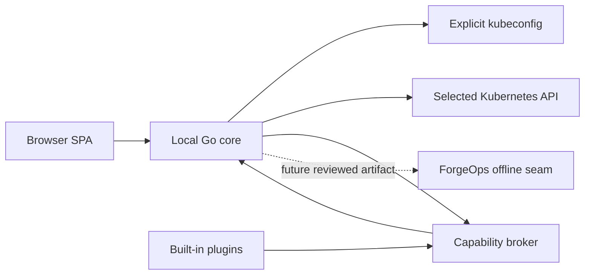

# ForgeOps Console architecture

**Status:** Accepted ForgeOps Console C1 design boundary. For the implemented
compiled plugin subset and its limits, see the
[C6 compatibility/lifecycle record](forgeops-console-c6-compatibility-lifecycle.md).

**Baseline:** The Foundry Initiative `main` at
`8008f6934a0c1bd34a63d6a86a9ad74d170a7671`

## Purpose

ForgeOps Console is a proposed local, browser-based Kubernetes operations
console. It should help an operator select an explicitly configured context,
inspect related resources, understand the equivalent `kubectl` command, and
prepare bounded evidence for the deterministic ForgeOps workflow.

The Console is not a replacement for `kubectl`, an administrative control
plane, or a new authority-bearing ForgeOps service. ForgeOps v1.0.0 and its
public artifacts remain unchanged.

## Operator outcome

The intended workflow is:

1. start one local Console process with an explicit kubeconfig path;
2. select one named context and namespace without changing the kubeconfig's
   persisted `current-context`;
3. inspect a resource and its owner or selector relationships;
4. invoke a bounded read or stream through a visible shortcut;
5. review the equivalent `kubectl` command and the exact active scope; and
6. explicitly select reviewed results for a later, separately versioned
   ForgeOps evidence workflow.

The Console must make context, namespace, resource, container, operation, and
limitations visible before any request.

## System boundary

### Browser application

The initial frontend is a TypeScript application built with Vite and served by
the local core. It is a presentation and interaction surface only. It must not:

- read, upload, receive, or persist kubeconfig content or credentials;
- contact a Kubernetes API directly;
- execute a shell or construct arbitrary server-side commands;
- load executable plugin code from a URL, registry, or user-supplied file; or
- gain access beyond operations exposed by the core capability broker.

The browser and API use one same-origin loopback endpoint. Cross-origin API
access is disabled. The core validates the `Host` and `Origin` headers and
requires an unguessable process-session nonce for stateful browser requests.

### Local Go core

The initial backend is a Go process using the official Kubernetes `client-go`
libraries. It binds only to explicit loopback addresses and owns:

- loading one operator-supplied kubeconfig path;
- listing its context names and non-secret display metadata;
- constructing a client for the selected context without modifying the file;
- applying request timeouts, response-size limits, concurrency limits, and
  cancellation;
- enforcing the supported-resource and supported-operation allowlists;
- checking the selected identity's apparent authorization before displaying an
  action when practical;
- treating the Kubernetes API response as the final authorization decision;
- applying disclosure rules before returning structured data to the browser;
- keeping a bounded in-memory activity record for the current process; and
- hosting the plugin registry and capability broker.

The core does not invoke `kubectl` to perform Kubernetes operations. Equivalent
commands are deterministic explanations generated from already validated
structured selections; they are not a shell execution path.

### Explicit configuration

The supported initial invocation requires an explicit kubeconfig argument. It
must fail closed when the path is absent, unreadable, not a regular file, or
contains no usable context. It must not fall back to `KUBECONFIG`, the default
home-directory kubeconfig, an in-cluster ServiceAccount, or a previously used
context.

Supporting multiple explicitly supplied kubeconfig files is deferred until a
separate contract defines merge order, duplicate names, identity display, and
conflict behavior.

## Initial resource and operation boundary

The planned read-only v0.1 surface is deliberately smaller than general
Kubernetes discovery:

| Resource or subresource | Initial behavior |
| --- | --- |
| Namespaces | List permitted names and select one scope |
| Nodes | List and read bounded status fields |
| Deployments | List/read, replica status, selector and owner relationships |
| ReplicaSets | List/read and show owning Deployment and selected Pods |
| Pods | List/read bounded status, containers, owners, and selected conditions |
| Services and EndpointSlices | List/read bounded selectors and endpoint readiness |
| Events | Bounded namespaced list/watch with time and count limits |
| Pod logs | Explicit Pod/container, bounded tail, optional follow, no disk persistence |
| ConfigMaps | Metadata and key names only; values are deferred |
| Secrets | Not listed, read, rendered, searched, exported, or requested |

The v0.1 core has no create, update, patch, apply, delete, scale, rollout,
port-forward, attach, exec, ephemeral-container, proxy, or arbitrary API-path
capability. Those operations are not merely hidden in the UI; they are absent
from the broker contract.

Logs may contain sensitive application data that deterministic redaction
cannot reliably identify. Log viewing is therefore explicit, bounded, held in
memory, excluded from automatic evidence capture, and accompanied by a visible
review warning.

## Plugin-ready modular structure

C1 chooses a modular monolith for the initial implementation:

- the core and first-party plugins are built and released together;
- plugins register through compile-time frontend and backend registries;
- plugins use the versioned Console SDK instead of internal packages;
- the initial loader must prohibit runtime downloads and remotely supplied
  executable modules;
- the core owns credentials, Kubernetes clients, authorization, disclosure,
  limits, confirmations, and activity records; and
- a plugin failure is contained by frontend error boundaries and backend
  request isolation rather than terminating the Console.

This structure proves real extension seams without creating a remote-code or
third-party supply-chain boundary prematurely. Installed or third-party plugin
packages require a later security and distribution decision.

## Proposed repository layout

The exact implementation layout is a C2 decision, but the intended ownership
is:

~~~text
apps/forgeops-console/
  web/                 browser application and frontend registry
  cmd/                 local process entry point
  internal/core/       kubeconfig, clients, broker, limits and disclosure
  internal/plugins/    first-party backend implementations
  packages/plugin-sdk/ public versioned plugin types and test harness
~~~

The Console remains in this repository so its integration with existing
ForgeOps contracts, tests, documentation, and release controls is reviewable.
It is packaged and versioned independently from `signalforge-forgeops`.

## First implementation slice

C2 should be a walking skeleton rather than a feature-complete dashboard. Its
candidate outcome is:

- start a loopback-only process;
- serve a static browser shell;
- load one explicit fixture kubeconfig through an injectable configuration
  seam;
- list context names without returning credentials;
- select one context in process memory;
- register one inert first-party example plugin; and
- prove all behavior against fake clients without contacting a cluster.

Any live SignalForge connection, packaging, image, deployment, or release
requires a separate gate after offline C2 acceptance.

## Explicit non-goals

C1 does not authorize:

- application implementation or dependency selection;
- in-cluster installation, ServiceAccounts, RBAC objects, Ingress, or NodePort;
- background collection or continuous monitoring;
- mutation, remediation, terminal access, or arbitrary command execution;
- storing kubeconfigs, bearer tokens, client keys, logs, or cluster objects;
- replacing Headlamp, K9s, `kubectl`, or the Kubernetes API;
- dynamic third-party plugins or a plugin marketplace;
- changing ForgeOps v1 schemas, collection authority, package, tag, or release;
  or
- treating UI convenience as evidence correctness, current health, diagnosis,
  severity, impact, or remediation authorization.
