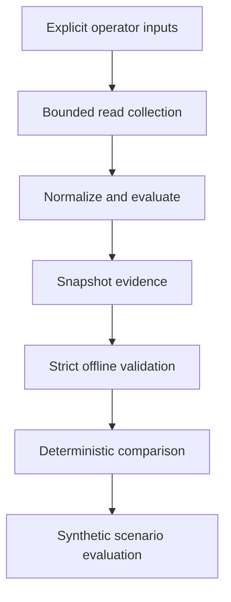

# ForgeOps operator and learning guide

ForgeOps is a local, bounded SignalForge operations tool. It collects a fixed
read-only snapshot, renders deterministic evidence, validates saved evidence,
and compares two validated artifacts. It does not diagnose incidents, recommend
changes, or mutate the cluster.

This guide explains the current system as a whole. The
[snapshot runbook](../runbooks/forgeops-snapshot.md) remains the procedural
reference, while the milestone documents preserve the historical decisions and
acceptance evidence.

## Start by identifying the executing code

Run provenance before relying on any ForgeOps command:

~~~powershell
forgeops provenance
~~~

The report identifies:

- the `foundry-check` distribution version that provides the `forgeops` entry
  point;
- the version declared by the loaded ForgeOps module;
- the Python executable;
- the loaded module path;
- installed, local-install, editable, or source execution mode; and
- the installation source when Python package metadata records one.

Provenance exit codes are local execution-identity results:

| Exit | Meaning |
| ---: | --- |
| `0` | The inspected identity is consistent. |
| `1` | The identity is visible, but a condition requires review. |
| `2` | The identity is inconsistent or cannot satisfy the declared mode. |

A temporary-directory editable installation returns a warning. A missing
editable source, version mismatch, invalid declared source root, or module
loaded outside that source returns an error. These codes are separate from
snapshot health, evidence validation, and comparison semantics.

The report contains local filesystem paths. Review it before sharing it outside
the operator workstation.

## Supported execution modes

### Operator mode: isolated normal install

Use a repository-local virtual environment and a non-editable install. From a
clean repository checkout:

~~~powershell
python -m venv .venv
.\.venv\Scripts\python.exe -m pip install --upgrade pip
.\.venv\Scripts\python.exe -m pip install .
.\.venv\Scripts\forgeops.exe provenance
~~~

Use that same environment for later commands. Reinstall after updating the
checkout so the installed copy deliberately advances:

~~~powershell
.\.venv\Scripts\python.exe -m pip install --upgrade --force-reinstall .
.\.venv\Scripts\forgeops.exe provenance
~~~

This mode avoids a global editable link to a checkout that may later move or be
deleted. The environment remains local to the repository and is ignored by Git.

### Development mode: current source tree

Use the repository-owned launcher when the intent is to execute the source in
the checkout being viewed:

~~~powershell
python .\scripts\run-forgeops-dev.py provenance
~~~

The launcher resolves the repository root from its own location, places that
exact `src` directory first on Python's import path, declares the source root
for provenance validation, and invokes the normal ForgeOps CLI. Its environment
change exists only inside that Python process.

Pass any normal ForgeOps arguments after the script name:

~~~powershell
python .\scripts\run-forgeops-dev.py `
  evidence validate --input .\forgeops-snapshot.json
~~~

Select a particular Python executable by using its path in place of `python`.
The launcher is for local development and review; operator use should prefer
the isolated normal installation.

### Unsupported default

A global `python -m pip install -e .` is not a supported operator setup. An
editable install can bind a shared interpreter to a temporary worktree and
continue resolving older source after the main checkout advances. If an
editable installation is deliberately used for development, keep it isolated,
use a stable checkout, and verify it with `forgeops provenance`.

## Recover from a stale editable installation

Use the same Python interpreter throughout this inspection:

~~~powershell
python -c "import forgeops; print(forgeops.__file__)"
python -m pip show foundry-check
python -m forgeops provenance
~~~

If `provenance` is rejected as an unknown command, the interpreter is exposing a
pre-Milestone-051 ForgeOps surface. The imported file and `pip show` output still
identify that installation so it can be removed deliberately.

If the loaded path points to an obsolete or temporary checkout, remove that
distribution from the interpreter:

~~~powershell
python -m pip uninstall foundry-check
~~~

Then create or rebuild the repository-local environment described above. Do not
manually delete package metadata while leaving an editable link in place.

## Command map

| Command | Input authority | Output | Exit domain |
| --- | --- | --- | --- |
| `forgeops provenance` | Local Python and package metadata | Execution identity | Provenance |
| `forgeops snapshot` | Explicit kubeconfig, exact context, optional explicit URLs | Text, Markdown, or snapshot JSON | Snapshot health/completeness |
| `forgeops evidence validate` | One explicit local JSON file | Contract-validity summary | Validation |
| `forgeops evidence compare` | Two explicit validated JSON files | Text or comparison JSON | Comparison |

## Architecture and evidence flow

The components preserve a one-way authority boundary:

- `runners.py` permits only fixed subprocess and HTTP operations;
- `collect.py` selects accepted fields from bounded responses;
- `evaluate.py` applies deterministic health semantics;
- `render.py` produces terminal, Markdown, and snapshot JSON views;
- `evidence.py` loads and validates one explicit saved artifact;
- `comparison.py` compares two immutable validated representations; and
- `provenance.py` inspects only local execution identity.

The synthetic scenario corpus exercises validation and comparison. It is not
captured cluster evidence, complete health, training data, diagnosis, or
recommendation.

## Keep the four exit domains separate

| Domain | `0` | `1` | `2` |
| --- | --- | --- | --- |
| Provenance | Identity consistent | Review finding | Identity error |
| Snapshot | Required checks pass | Warning or failure | Invalid invocation or incomplete required evidence |
| Validation | Artifact contract valid | Not used | Artifact invalid or unreadable |
| Comparison | Valid artifacts equivalent | Valid artifacts differ | Invalid artifact or chronology |

Validation exit `0` does not mean the contained snapshot is healthy. Comparison
exit `1` does not mean an incident is severe or unresolved; a valid recovery
also differs from its earlier evidence and returns `1`.

## Trust and authority boundaries

ForgeOps currently may:

- inspect its local execution identity;
- perform the fixed read-only SignalForge collection contract;
- make bounded GET requests only to explicit accepted application base URLs;
- read one or two explicit bounded evidence files; and
- render deterministic local output.

ForgeOps does not currently establish:

- artifact authorship, cryptographic authenticity, or chain of custody;
- complete cluster health or continuous monitoring;
- causation, severity, diagnosis, or recommended action;
- runbook applicability;
- permission to retain or share evidence; or
- any authority to remediate or mutate the cluster.

Execution provenance answers which local code and interpreter are running.
Evidence provenance and integrity are different future concerns and require a
separate contract. Scenario replay, grounded runbook mapping, and bounded
incident reasoning likewise remain separately planned capabilities.

## Documentation map

- [Snapshot runbook](../runbooks/forgeops-snapshot.md): operating commands and
  failure handling.
- [Architecture](../architecture.md): current system design and authority
  boundaries.
- [Project status](../project-status.md): current accepted state.
- [Roadmap](../../ROADMAP.md): sequencing and later outcomes.
- [Milestones 044-050](../milestones): chronological design, implementation,
  validation, and closeout evidence.

Historical milestone documents remain intact. This guide is the consolidated
current explanation and links back to that evidence rather than replacing it.
